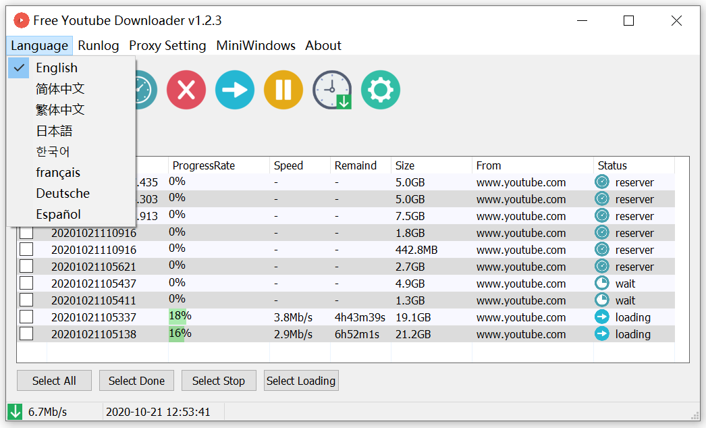
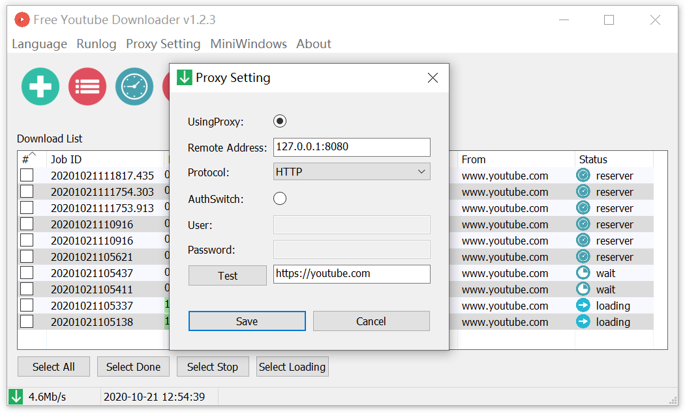
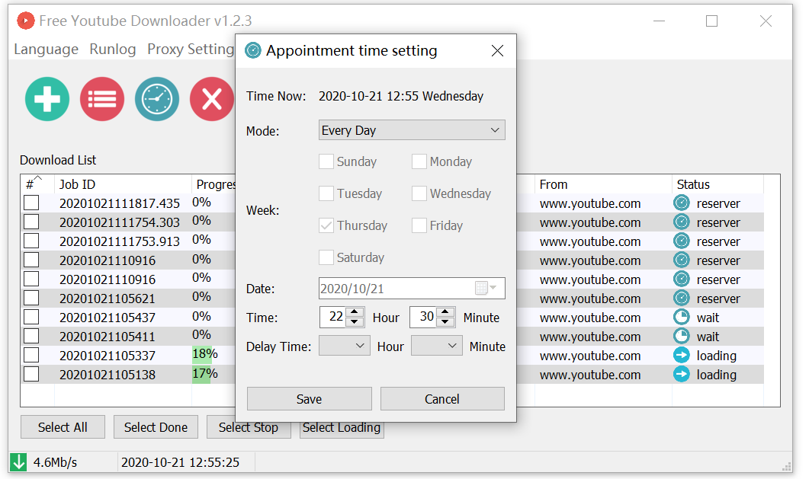

# Free Youtube downloader

[English](./README.md)
[中文](./README_ZH_CN.md) 

## Features
- Support multi thread download
- Support scheduled download of appointment
- Support Windows UI client
- Support multi language interface
- Support batch addition
- Support custom download format
- Support http & sock5 proxy
- Supports stopping and retrying downloads
- Support windows 32bit and 64bit programs

## Main window

- Provide configuration menu, support language settings, network proxy settings, and about, window minimized hidden
- The second layer tool buttons provide task management operations; including add, batch add, timer appointment setting, delete, re-download, stop download, download setting;

## Language settings
- Support English, Chinese, Japanese, Korean, French, Spanish, German

## Proxy settings
- Support HTTP, HTTPS, SOCK5 proxy protocol, support authentication
- Support to test validity of the proxy

## Add download job
- Get the pasteboard link automatically, if the pasteboard has a link copy.
- After obtaining the link, the video information is automatically updated. And display; select the corresponding video resource. Click to download or schedule download.

## Batch add download job
- Support multiple link input, provide simple video type selection;

## Appointment settings
- Provide three trigger types: daily, weekly, and fixed date

## Download settings
- Provide the default download directory, the number of concurrent download tasks; and bandwidth limit;

### Give me a coffee;

### [paypal.me](https://paypal.me/lixiangyun)

### Alipay

### Wechat Pay 

