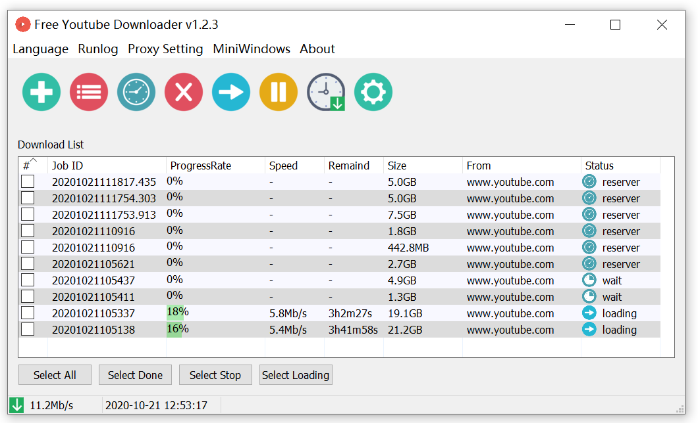
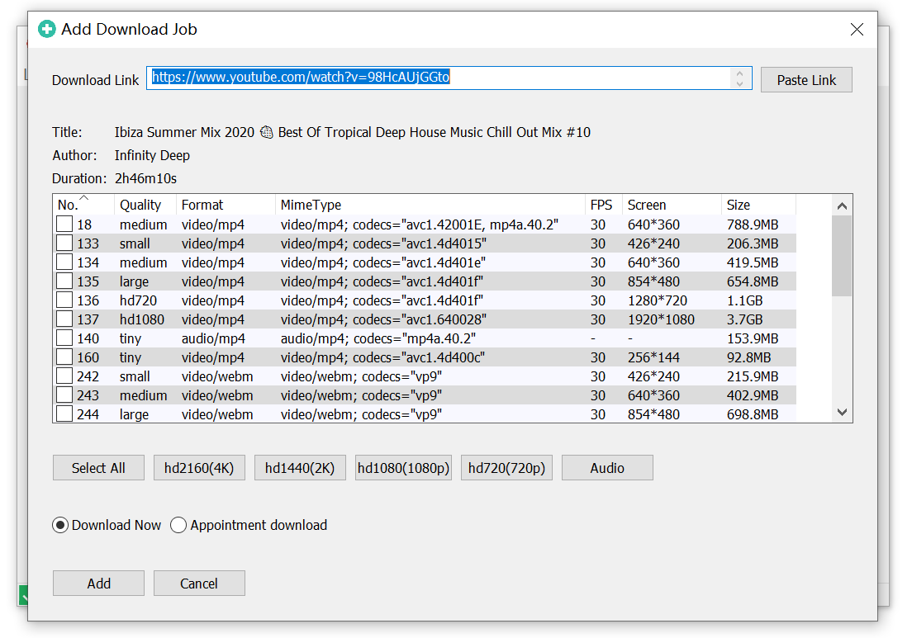
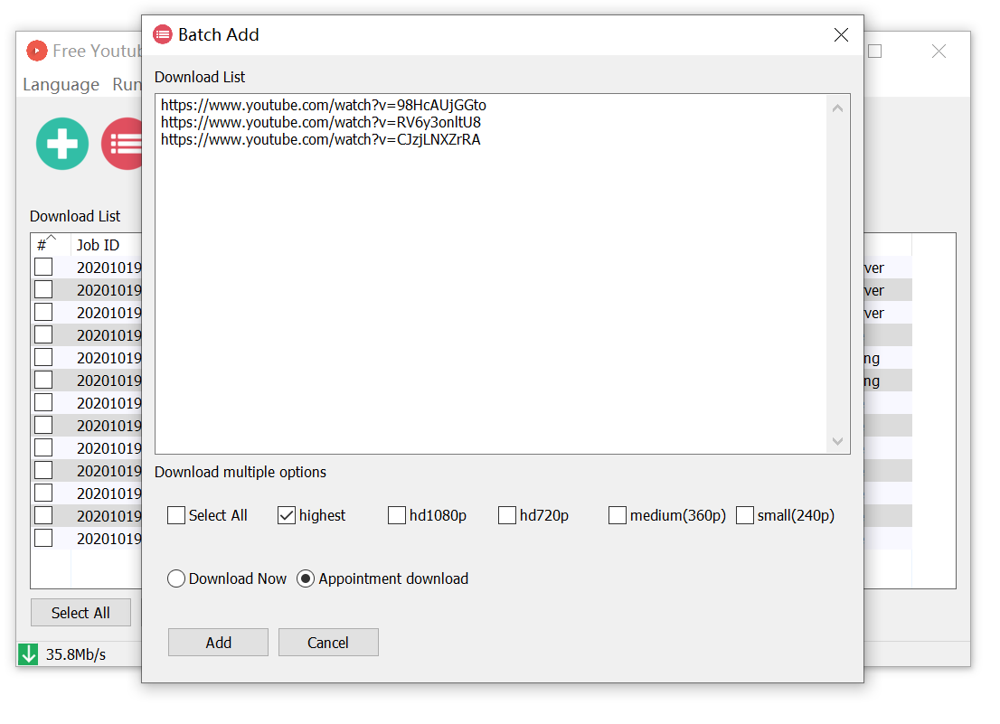

# Free Youtube downloader

[English](./README.md)
[中文](./README_ZH_CN.md) 

## 特性

- 支持多线程下载
- 支持预约预约下载
- 支持Windows客户端
- 支持多国语言
- 支持批量添加
- 支持自定义下载格式
- 支持http和sock5代理
- 支持停止和重试下载
- 支持Windows 32位和64位程序

## 主窗口
- 提供配置菜单，支持语言设置，网络代理设置以及有关最小化隐藏的窗口
- 第二层工具按钮提供任务管理操作； 包括添加，批量添加，定时器预约设置，删除，重新下载，停止下载，下载设置；

## 语言设置
- 支持英语，中文，日语，韩语，法语，西班牙语，德语

## 代理设置
- 支持HTTP，HTTPS，SOCK5代理协议，支持身份验证
- 支持测试代理的有效性

## 添加下载任务
- 如果粘贴板具有链接副本，则自动获取粘贴板链接。
- 获取链接后，视频信息将自动更新。 并显示； 选择相应的视频资源。 单击下载或安排下载。

## 批量添加下载任务
- 支持多链接输入，提供简单的视频类型选择；

## 预约设置
- 提供三种触发类型：每日，每周和固定日期

## 下载设置
- 提供默认的下载目录，并发下载任务数； 和带宽限制；

### 请作者喝咖啡

### [paypal.me](https://paypal.me/lixiangyun)

### Alipay

### Wechat Pay 

